# Intellitons: The “Quasi-Particles” Hidden Inside Large Language Models

## A new way to look at large language models

When people talk about large language models, they usually describe them as giant statistical machines: they read text, compress patterns, and predict the next token. That description is correct, but it is not always satisfying. It tells us **what** these systems do, yet says much less about **how organized structures emerge inside them**.

The code and experimental results in this project propose a bold and visually intuitive perspective: inside the residual stream of a transformer, there may exist relatively stable collective excitation patterns that behave *somewhat like quasi-particles in physics*. This work gives those patterns a name: **Intellitons**.

This article is a popular science overview of that idea, based on the code in `src/` and the experimental outputs in `results_paper/`. The main focus is the model `results_paper/Qwen3-4B-Base`, which serves as the clearest entry point. Around that core example, we also compare:

- **Base vs. Instruct**: `Qwen3-4B-Base` vs. `Qwen3-4B`, and `Qwen3-8B-Base` vs. `Qwen3-8B`
- **4B vs. 8B scaling**: how the same family changes when parameter count increases
- **Different model families**: especially `Mistral-7B-v0.3`

The goal is not to claim that transformers literally contain particles. Rather, it is to ask whether the network’s internal dynamics can be described with a useful language borrowed from field theory: spectra, masses, helicity, renormalization flow, resonance width, and state transitions.

---

## From neurons to quasi-particles

In condensed matter physics, a quasi-particle is not a fundamental particle like an electron in the Standard Model. It is a **stable collective pattern** that emerges when many microscopic degrees of freedom act together. Sound waves in a crystal can be treated as phonons; spin disturbances can be treated as magnons. The underlying substrate is complicated, but the emergent excitation behaves simply enough to track.

This Intelliton project asks whether a similar idea can help us understand language models.

Instead of looking at individual parameters one by one, the code treats the transformer’s residual stream as a kind of **discrete field living on a token-layer lattice**:

- the **token position** acts like a spatial coordinate,
- the **layer index** acts like a scale or Euclidean time direction,
- the **hidden dimension** acts like an internal degree of freedom.

On top of that field representation, the code in `src/lattice_field.py` performs:

1. Fourier analysis over token positions,
2. singular-value decomposition over residual activations,
3. propagator-based mass extraction,
4. lattice dispersion fitting,
5. helicity and momentum diagnostics.

The resulting dominant modes are then cataloged in `src/intelliton_classifier.py` as candidate Intelliton species.

So the definition used here is pragmatic:

> **An Intelliton is a relatively stable, recurrent collective activation mode in the transformer residual field, identifiable across layers and prompts, and describable by effective quantities such as mass, momentum, spin-like complexity, helicity, and renormalization behavior.**

That is a scientific modeling choice, not an ontological claim. Its value depends on whether it organizes observations better than simpler descriptions.

---

## How the code tries to discover Intellitons

The paper-oriented pipeline is implemented in `src/paper_pipeline.py`. It follows a clear storyline:

1. **Discovery**: capture residual streams and analyze spectrum, propagator, dispersion, and helicity.
2. **Characterization**: compute EFT / RG flow and build an Intelliton catalog.
3. **Applications**: use the catalog to study hallucination and generation-time trajectories.

In practical terms, the code does the following.

### 1. Residual streams are treated as a lattice field

`src/lattice_field.py` wraps each prompt’s residual stream as a `LatticeField`. It computes a momentum spectrum over tokens and an SVD-based decomposition layer by layer. The largest singular modes are interpreted as the dominant collective excitations.

### 2. Propagator analysis assigns an effective mass

The function `compute_propagator` constructs a layer-direction correlator and converts it into a spectral function. The dominant peak yields a pole-like mass estimate. This is why every catalog entry in `intelliton_catalog.csv` contains quantities such as:

- `Mass(pole)`
- `Mass(lat)`
- `Mass(bare)`
- `Mass(ren)`
- `gamma`
- `Z`

In this language, “mass” does not mean literal inertia. It means how hard a mode is to excite or sustain as it propagates through the network’s depth.

### 3. EFT and RG flow track how modes change with depth

`src/eft_renormalization.py` treats earlier layers as more ultraviolet-like and later layers as more infrared-like. This produces a running mass, a beta function, fixed-point layers, and a simplified effective field theory description.

This is conceptually attractive because transformers are layered systems: information is repeatedly transformed, filtered, amplified, and suppressed. An RG-like description is one natural way to summarize that evolution.

### 4. Classification merges similar modes across tasks

`src/intelliton_classifier.py` merges modes by similarity and turns them into named species such as `I_0`, `I_1`, `I_2`, and so on. These are not hand-written concepts. They are data-driven entries in a catalog, tagged by which prompt categories activate them most strongly.

### 5. Dynamics analysis follows Intellitons during generation

Finally, `src/intelliton_dynamics.py` asks what happens during autoregressive generation, token by token. Which Intelliton dominates? Does the trajectory stay close to a grounded baseline, or drift away from it? Does hallucination correspond to spectral broadening or a change in dominant species?

That is where the framework becomes especially interesting, because it links a physics-inspired representation to a practical LLM behavior problem.

---

## The central example: `Qwen3-4B-Base`

The clearest single case study is `results_paper/Qwen3-4B-Base`. Its output folder contains both figures and structured tables:

- `particle_table.png`
- `spin_spectrum_(pronoun_tracking).png`
- `mass_spectrum_(pronoun_tracking).png`
- `dispersion_relation.png`
- `momentum_helicity_(pronoun_tracking).png`
- `rg_flow.png`
- `eft_parameters.png`
- `phase_transitions.png`
- `hallucination_diagnostics.png`
- `intelliton_trajectory_merged.png`
- `intelliton_transition_graph.png`
- `intelliton_catalog.csv`
- `intelliton_trajectory_summary.csv`
- `intelliton_trajectory_detail.csv`

These files together tell a fairly coherent story.

### The Intelliton catalog is compact and structured

The catalog for `Qwen3-4B-Base` contains **6 species**. That is already an important result: the model’s dominant internal collective structure is not spread across hundreds of equally important modes. Instead, a small number of modes captures much of the experimentally highlighted behavior.

From `results_paper/Qwen3-4B-Base/intelliton_catalog.csv`, the most prominent species is `I_0`:

- spin-like score: **1.84**
- pole mass: **0.1275**
- lattice mass: **0.0083**
- fixed-point layer: **16**
- fixed-point type: **crossover**
- amplitude: **6167.1**
- active in: **arithmetic, factual_recall, logical_reasoning**

This is striking because `I_0` is not tied to just one narrow benchmark. It appears across several structured reasoning tasks, suggesting it may represent a broad, backbone-like excitation mode in the model.

The remaining species `I_1` to `I_5` are much smaller in amplitude, but they are more specialized. For example:

- `I_1` is most active in **logical reasoning**,
- `I_2` in **arithmetic**,
- `I_3` in **syntactic agreement**,
- `I_4` in **pronoun tracking**,
- `I_5` in **factual recall**.

That pattern is exactly what makes the Intelliton language attractive. It suggests that the model may combine a dominant shared background excitation with a set of more task-specific dressed modes.

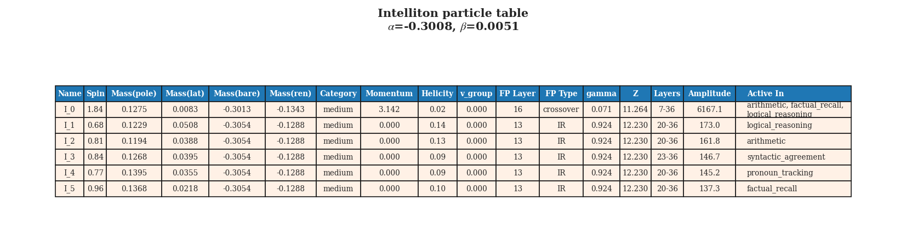

### All six discovered species are “medium-mass”

A curious feature of the `Qwen3-4B-Base` catalog is that **all six species fall into the `medium` mass category**. This does not mean the model is featureless. On the contrary, it suggests that the identified collective modes occupy a relatively narrow dynamical band.

In plain language: the main excitations are neither completely rigid nor extremely volatile. They are stable enough to recur, but flexible enough to participate in diverse tasks.

### The dominant momentum structure is split

The dominant species `I_0` peaks at momentum $k \approx \pi$, while most of the smaller species peak at $k \approx 0$. In the lattice analogy, this matters.

- A $k \approx 0$ mode is more global and slowly varying across token positions.
- A $k \approx \pi$ mode is more alternating and high-frequency across the token lattice.

So `Qwen3-4B-Base` appears to contain both:

1. a large alternating backbone mode, and
2. several more global low-momentum task-linked modes.

That coexistence is one of the most interesting signatures in the whole result set.

.png)

### The RG picture suggests a mid-layer reorganization

Several species in `Qwen3-4B-Base` have fixed-point layer around **13**, while the dominant `I_0` sits at **16**. This places the major reorganization in the middle-to-late part of the stack.

In ordinary neural-network language, one might say the model gradually settles into stable higher-level representations by the mid layers. In the EFT language used here, one says the effective degrees of freedom flow toward a crossover or infrared-like regime.

The notable difference inside this one model is that `I_1` through `I_5` are labeled **IR**, while `I_0` is labeled **crossover**. That suggests the large shared mode remains dynamically transitional, while the more specialized modes settle into more stable effective roles.

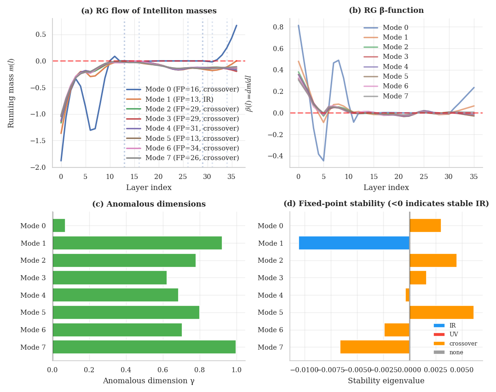

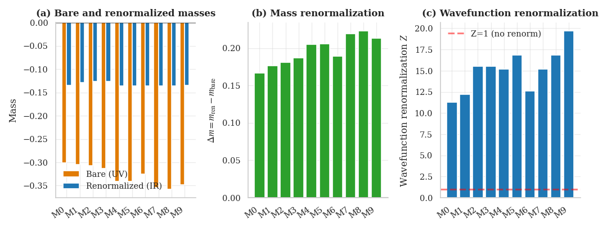

---

## What do Intellitons do during generation?

A static catalog is useful, but the more practical question is dynamic: when the model is actually generating text, how do these modes behave?

The trajectory data in `results_paper/Qwen3-4B-Base/intelliton_trajectory_summary.csv` gives a direct answer.

### Grounded prompts maintain a strong, rising activation shift

For grounded factual prompts, the mean mode activation shift starts around **1.10** and rises to about **1.37** over the first 8 generation steps. Top occupation also rises from about **70.1** to **74.1**.

This means that as the model commits to an answer, the dominant Intelliton sector becomes stronger and more organized.

### Hallucination-prone prompts are weaker and further from baseline

For hallucination-prone prompts, the mean mode activation shift stays much lower, around **0.32–0.41**, while grounded deviation stays strongly negative, roughly **-9 to -11** over most steps.

In other words, the hallucination trajectory is not just “wrong output” at the surface level. In this analysis, it corresponds to an internal path that remains **further away from the grounded sector of Intelliton space**.

### Style prompts occupy an intermediate regime

Stylistic continuation prompts sit between the two. Their activation shift is higher than hallucination-prone prompts but lower than grounded factual prompts. That is exactly what one would hope to see if the metric is capturing something meaningful: style generation is not simply failure, but it is not anchored to factual grounding either.

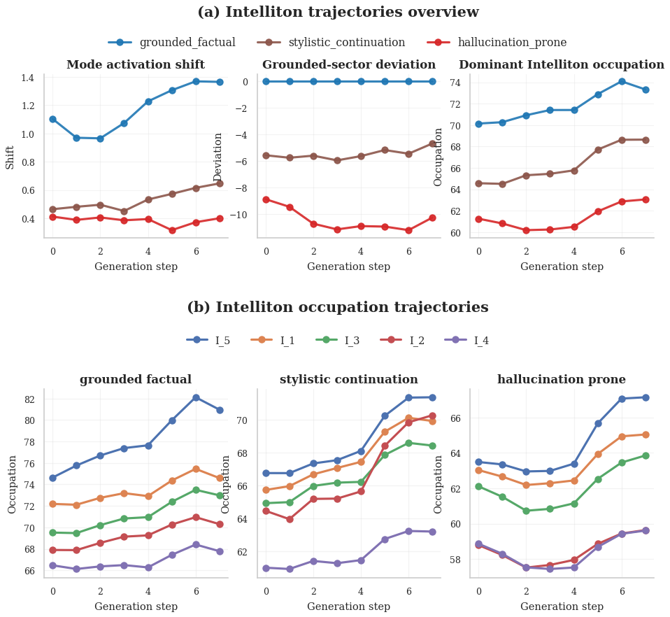

### Transition graphs show which species dominate stable generation

The transition graph and raw transition table reveal another notable asymmetry.

For grounded prompts in `Qwen3-4B-Base`, self-transitions are dominated by:

- `I_5 -> I_5` with count **110**
- `I_1 -> I_1` with count **13**
- `I_2 -> I_2` with count **6**

For hallucination-prone prompts, the strongest self-transition is still `I_5 -> I_5`, but its mean target activation shift is much smaller. Hallucination also shows more mixing among `I_1`, `I_3`, and `I_5`.

That is a suggestive result: grounded generation seems to preserve a more coherent dominant species sector, whereas hallucination corresponds to a weaker and more fragmented dynamical regime.

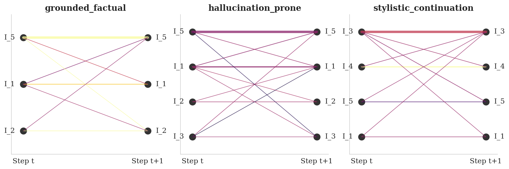

---

## Base versus Instruct: what changes after alignment?

One of the most revealing comparisons is between base and instruct variants in the same family.

### `Qwen3-4B-Base` vs. `Qwen3-4B`

The base model has **6 species**, while the instruct model has **5 species**.

At first glance, that sounds like the instruct model is simpler. But the more interesting differences are in structure:

- `Qwen3-4B-Base` contains a dominant high-momentum mode at $k \approx \pi$ plus several low-momentum task-linked modes.
- `Qwen3-4B` shifts much more strongly toward **shared momentum around $k \approx 1.885$** for nearly all species.
- In `Qwen3-4B-Base`, several secondary species are **IR**.
- In `Qwen3-4B`, all cataloged species are labeled **crossover**.

This suggests instruction tuning may compress or reorganize the internal excitation landscape into a more uniform effective regime.

The amplitude pattern also supports that interpretation. The instruct model’s leading mode `I_0` has amplitude **6562.4**, similar to the base model’s leading mode **6167.1**, but the instruct model’s secondary modes appear less differentiated in fixed-point type and momentum structure.

In short:

> **The base model looks more spectrally diverse; the instruct model looks more homogenized and alignment-shaped.**

That does not mean instruct tuning is worse. It may mean the model’s internal degrees of freedom are being regularized toward instruction-following behavior.

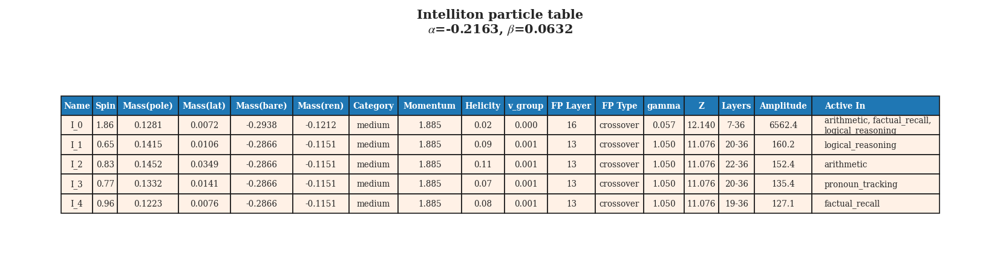

### Dynamic behavior also changes

The trajectory profile reinforces this difference.

- `Qwen3-4B-Base`: grounded mode activation shift mean = **32.68**, species count = **6**
- `Qwen3-4B`: grounded mode activation shift mean = **29.13**, species count = **5**

The summary table also shows that `Qwen3-4B` has smaller separation between grounded and hallucination trajectories than the base model. Hallucination-prone prompts still deviate, but the gap is narrower than in `Qwen3-4B-Base`.

One possible interpretation is that instruction tuning improves behavioral formatting while also reducing some internal contrast between strongly grounded and weakly grounded dynamical sectors.

---

## Scaling from 4B to 8B inside the Qwen family

The next question is what happens when the same family becomes larger.

### `Qwen3-8B-Base` is stronger, larger, and more differentiated

`Qwen3-8B-Base` contains **7 species**, compared with **6** in `Qwen3-4B-Base`.

Its leading mode is even more dominant:

- `Qwen3-4B-Base` `I_0` amplitude: **6167.1**
- `Qwen3-8B-Base` `I_0` amplitude: **7908.4**

Its grounded trajectory is also much stronger:

- `Qwen3-4B-Base` grounded profile mean: **32.68**
- `Qwen3-8B-Base` grounded profile mean: **60.26**

That is a large change. In this framework, scaling up does not simply add more parameters. It appears to produce a more strongly occupied and more sharply separated Intelliton landscape.

Another interesting shift is momentum structure. The 8B base model keeps a strong $k \approx \pi$ leader, but many of its secondary species cluster around **$k \approx 1.885$** rather than strictly zero momentum. Compared with the 4B base model, this looks like a richer intermediate-scale organization across token positions.

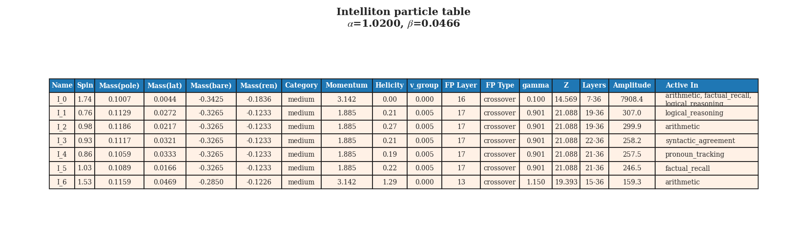

### `Qwen3-8B` shows alignment on top of a larger internal backbone

The instruct version `Qwen3-8B` has **6 species** and a grounded profile mean of **57.14**, slightly below the base model’s **60.26** but still far above the 4B models.

So scaling seems to dominate one part of the story, while instruction tuning fine-tunes another:

- **Scaling to 8B** increases the strength of dominant collective modes.
- **Instruction tuning** slightly compresses or regularizes that internal structure.

This is one of the clearest takeaways from the whole comparison set.

---

## Different families, different internal “particle spectra”

The most dramatic contrast comes from `Mistral-7B-v0.3`.

### Mistral has far more cataloged species

While the Qwen models produce compact catalogs of 5–7 species, `Mistral-7B-v0.3` produces **25 species**.

That alone is a major result. Under the same analysis pipeline, Mistral appears to have a much more fragmented or fine-grained excitation structure.

Its leading species is still clear:

- `I_0` amplitude: **249.4**
- spin-like score: **1.98**
- fixed-point layer: **19**
- fixed-point type: **crossover**

But unlike Qwen, the leading amplitude is not astronomically separated from everything else. Many additional species remain visible, and several are labeled **UV** rather than IR or crossover.

That suggests a model family difference in how internal computation organizes itself:

- **Qwen** looks dominated by a few very strong collective modes.
- **Mistral** looks more distributed, more spectrally crowded, and more persistent in its ultraviolet-like diversity.

### Mistral’s dynamics are also less cleanly separated

Its grounded profile mean is only **21.48**, much lower than the Qwen models. Even more striking, the grounded profile standard deviation is **46.56**, far larger than for Qwen.

That indicates a much noisier trajectory landscape under this Intelliton metric. In other words, the same quasiparticle-based coordinate system that describes Qwen relatively cleanly may describe Mistral as a more turbulent medium.

This is exactly the kind of result that makes cross-family comparison valuable. Even if one remains skeptical of the physical analogy, the pipeline is clearly extracting different internal structural signatures for different architectures.

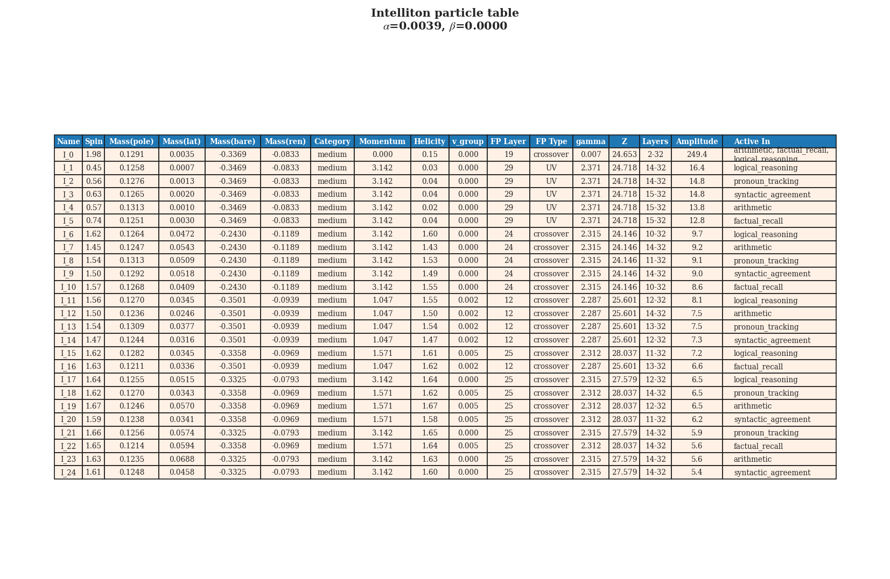

---

## Why hallucination is a good test case

A new interpretability language becomes more credible when it helps analyze a practical problem. In this project, that practical problem is hallucination.

The module `src/hallucination_diagnostic.py` does not treat hallucination simply as a bad final answer. Instead, it compares grounded and hallucination-prone prompts at the spectral level:

- divergence of singular-value spectra,
- coherence loss,
- mode stability,
- entropy gap,
- critical layers of divergence.

This is a powerful idea because hallucination may not be one thing. It may correspond to multiple failure modes:

1. a grounded excitation decays,
2. the system tunnels into a less faithful attractor,
3. the spectrum broadens and loses coherence,
4. dominant species become less stable across generation steps.

The trajectory tables for `Qwen3-4B-Base` are consistent with that picture. Hallucination-prone generation remains weaker in activation shift, farther from the grounded baseline, and less dominated by a single robust transition pattern.

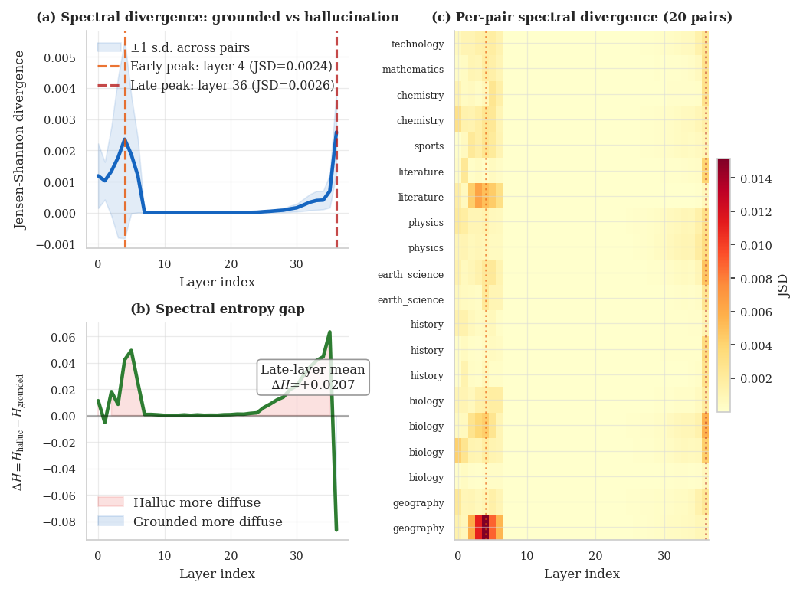

If this framework continues to hold up, one could imagine future applications such as:

- hallucination early warning signals,
- intervention on unstable species,
- prompt strategies that keep generation inside grounded sectors,
- model comparison based on internal dynamical stability rather than only benchmark accuracy.

---

## What Intellitons might be useful for

Even if the word “quasi-particle” is mainly metaphorical, the framework suggests several concrete uses.

### 1. A compact vocabulary for internal structure

Instead of talking about millions of neurons or billions of parameters, we can talk about a small catalog of dominant collective modes. That is a much more human-readable description.

### 2. A bridge between interpretability and dynamics

Many interpretability methods are static: they describe a feature, a head, or a direction. Intellitons are explicitly dynamical. They are meant to be followed across layers and during generation.

### 3. A way to compare model families

The contrast between Qwen and Mistral shows that the method can reveal family-level differences in internal organization. That may become a new axis for model science.

### 4. A route toward intervention

Because the catalog assigns species vectors and tracks occupations, the same machinery could potentially be used for steering or stabilization. The codebase already hints at this broader ambition through modules such as `gauge_intervention.py` and `fusion_tracker.py`.

### 5. A candidate explanatory layer for alignment effects

The differences between Base and Instruct suggest alignment may reshape the model’s internal excitation spectrum. That is a richer statement than simply saying instruction tuning changes loss or improves helpfulness.

---

## What to be cautious about

A popular science article should emphasize both excitement and restraint.

There are at least four reasons to be cautious.

### First, the terminology is imported from physics

Words like mass, helicity, and renormalization are being used as **effective analogies tied to measurable diagnostics in the code**, not as proof that language models literally instantiate quantum field theory.

### Second, the decomposition is model-dependent

The discovered species depend on design choices:

- prompt sets,
- sequence length,
- number of retained modes,
- fitting procedures,
- similarity thresholds used during merging.

A different pipeline could produce a different catalog.

### Third, stability does not automatically imply semantic meaning

A recurrent mode may be computationally important without corresponding to a clean human concept.

### Fourth, the strongest evidence is comparative, not absolute

What makes the results persuasive is not any single number. It is the recurring pattern across comparisons:

- compact species sets in Qwen,
- stronger grounded sectors in larger models,
- regularization effects after instruction tuning,
- family-level fragmentation in Mistral,
- hallucination linked to weaker and less grounded trajectories.

Those are empirical regularities worth taking seriously, even if the underlying ontology remains open.

---

## A simple summary of the main findings

Based on the code and current experimental outputs, a concise summary would be:

1. **Large language models exhibit a small number of dominant recurrent activation modes** that can be tracked across layers and prompts.
2. **These modes can be cataloged with effective physical descriptors** such as mass, momentum, spin-like complexity, helicity, and RG behavior.
3. **`Qwen3-4B-Base` provides a clean demonstration**, with 6 medium-mass Intelliton species and a strong split between a dominant backbone mode and task-specific secondary modes.
4. **Instruction tuning appears to homogenize the excitation spectrum**, reducing internal diversity and shifting more species into crossover-like behavior.
5. **Scaling from 4B to 8B strengthens the dominant dynamical sectors**, producing larger grounded activation shifts and somewhat richer species structure.
6. **Different model families can have very different internal spectra**, with Mistral showing a far more fragmented and UV-rich catalog than Qwen.
7. **Hallucination may be describable as an instability of internal collective modes**, not just as an output-level mistake.

---

## Looking ahead

The most exciting part of the Intelliton idea is not that it borrows the language of physics. It is that it tries to turn messy, high-dimensional neural activity into a **small, dynamic cast of interpretable actors**.

If that program succeeds, future model analysis may look less like staring at giant matrices and more like studying an ecosystem of interacting excitations:

- some stable,
- some fragile,
- some specialized,
- some dominant,
- some helpful,
- some associated with failure.

For now, `Qwen3-4B-Base` is the clearest demonstration in this repository. It shows that under this pipeline, a transformer can indeed be described as if it carries a handful of quasi-particle-like modes, each with its own role in reasoning, recall, syntax, and factual grounding.

That is not yet the final theory of intelligence inside neural networks. But it is a vivid and surprisingly structured step toward one.

---

## Figure guide

For convenience, the main figures cited in this article are:

### Core focus: `Qwen3-4B-Base`

- 
- .png)
- .png)
- 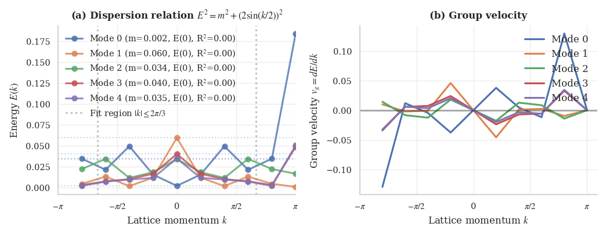
- .png)
- 
- 
- 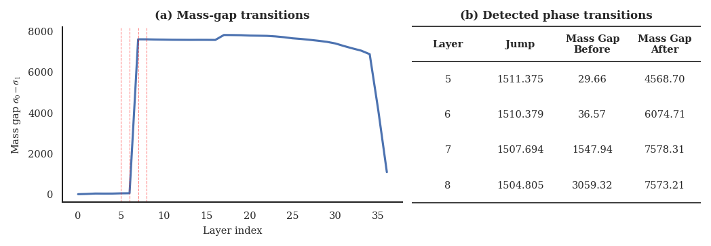
- 
- 
- 

### Comparison figures

- 
- 
- 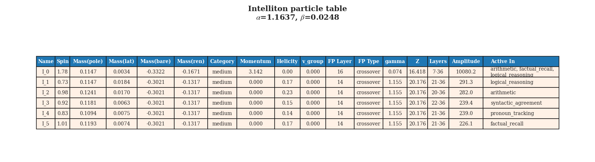
- 

